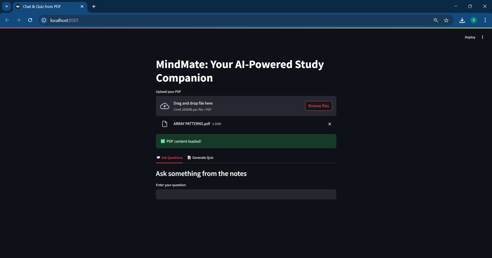
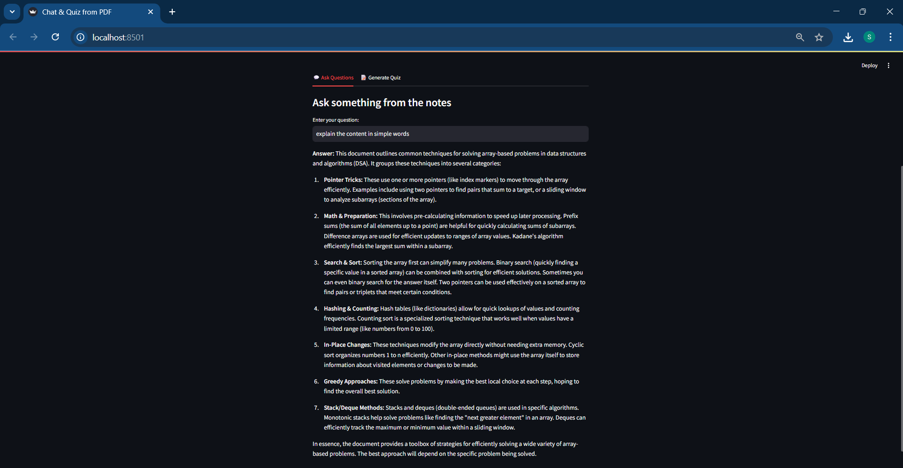
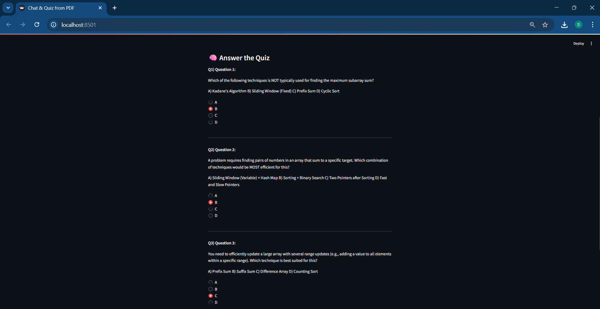
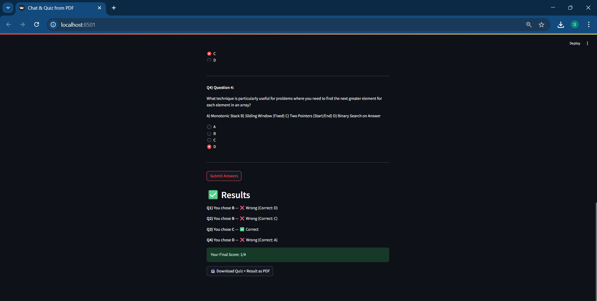

# MindMate: Your AI-Powered Study Companion

MindMate is a Streamlit web app that lets you chat with your notes, generate quizzes, and evaluate your knowledge — all from a single PDF. Powered by Gemini 1.5 Flash, it's the perfect study partner for smart learners.

## Features

- Upload PDFs (lecture notes, manuals, etc.)
- Ask questions directly from the notes using AI
- Auto-generate MCQ quizzes (1–10 questions)
- Real-time answer feedback (Correct/Incorrect)
- Displays final score
- Download quiz and results as a PDF
- Powered by Google Gemini 1.5 Flash

## How to Run Locally

### 1. Clone this repository

```bash
git clone https://github.com/ANUSHKA49282/MINDMATE
cd mindmate
```

### 2. Install dependencies

```bash
pip install -r requirements.txt
```

### 3. Set your API key

Create a `.env` file in the root directory with the following content:

```
GOOGLE_API_KEY=your_api_key_here
```

Get your API key from: https://aistudio.google.com/app/apikey

### 4. Run the app

```bash
streamlit run app.py
```

## Folder Structure

```
mindmate/
├── app.py
├── .env
├── requirements.txt
├── README.md
└── screenshots/
    ├── home.png
    ├── chat.png
    ├── quiz.png
    └── result.png
```

## UI Preview

| Home | Chat | Quiz | Results |
|------|------|------|---------|
|  |  |  |  |

## License

This project is licensed under the MIT License.
